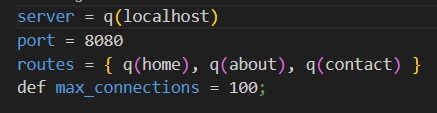

# Задание
 Разработать инструмент командной строки для учебного конфигурационного языка, синтаксис которого приведен далее. Этот инструмент преобразует текст из входного формата в выходной. Синтаксические ошибки выявляются с выдачей сообщений.
 Входной текст на языке **toml** принимается из стандартного ввода. Выходной текст на **учебном конфигурационном языке** попадает в стандартный вывод.
Однострочные комментарии:
' Это однострочный комментарий
Массивы:
{ значение, значение, значение, ... }
Имена:
[_a-z]+
Значения:
- Числа.
- Строки.
- Массивы.
Строки:
q(Это строка)
Объявление константы на этапе трансляции:
def имя = значение;
Вычисление константы на этапе трансляции:
@[имя]
---
Результатом вычисления константного выражения является значение.
Все конструкции учебного конфигурационного языка (с учетом их возможной вложенности) должны быть покрыты тестами. Необходимо показать 2 примера описания конфигураций из разных предметных областей.
---
Ниже представлены результаты работы программы и тестирования.

